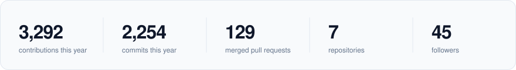

<picture><source media="(prefers-color-scheme: dark)" srcset="./assets/hero-dark.svg"></picture>

I'm a big data engineer who spends the other half of the day building tools for AI-assisted development: multi-agent coding workspaces, datastore CLIs and provider managers for Claude Code, Codex and Gemini CLI.

<picture><source media="(prefers-color-scheme: dark)" srcset="./assets/stats-dark.svg"></picture>

<picture><source media="(prefers-color-scheme: dark)" srcset="./assets/skills-dark.svg"></picture>

Mostly debugging.
